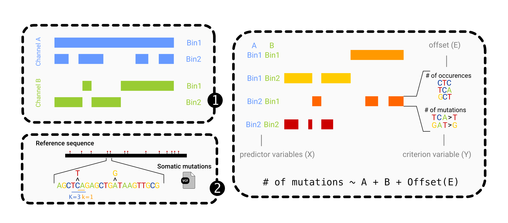

<!-- README.md is generated from README.Rmd. Please edit that file -->

# regionMut 

<!-- badges: start -->

[](https://travis-ci.com/davidmasp/regionMut)
[](https://codecov.io/gh/davidmasp/regionMut?branch=master)
[](https://www.tidyverse.org/lifecycle/#experimental)
<!-- badges: end -->

The goal of regionMut is to perform an statistical analysis of mutation
enrichment in regions of interest such as genes/promoters/epigenetic
bins. Regions will be represented in channels of bed files. Multiple
channels can be inputed together. This will effectively control for
different channels. Region channels with strand specification can be
used only once, as a possible clash in the strand definition can be
problematic.

The concept behing regionMut can be exemplified here:



## Installation

The installation process is divided in the R package which basically
hosts all the functionallity and a small launcher in python that can be
installed with pip.

Currently it only tests in UNIX systems with bash. It could also be
installed in the WSL.

<!--
You can install the released version of regionMut from 
[CRAN](https://CRAN.R-project.org) with:

``` r
install.packages("regionMut")
```
-->

You can install the development version of the R package directly from
[GitHub](https://github.com/) repo with:

``` r
# install.packages("devtools")
# Note if private you need the PAT in your .Renviron file
devtools::install_github("davidmasp/regionMut@develop")
```

The launcher can be installed after cloning this directory with:

    gh repo clone davidmasp/regionMut
    # git clone https://github.com/davidmasp/regionMut.git
    cd regionMut
    pip install .

After installing the python wrapper you can launch the multiple
regionMut modes (available at [`exec` folder](./exec/)) using the CLI
utility `regionmut`. Please note that updating the R package won’t
update the launcher, however, it is not likely to change dramatically.

## Usage

The normal use of regionmut is by the CLI so the 2 steps above should be
performed before this.

### Input files

The complete usage of regionMut will require 2 input configuration
files. One will contain the information about region channels and bins
within those and the other will configure the regression parameters used
in the analysis.

-   An example of how the **input table** should look is found
    [here](inst/testdata/test_bins.tsv):

| master_name | bins    | file_name                                    | strand |
|:------------|:--------|:---------------------------------------------|:-------|
| bed1        | a       | inst/testdata/test_bed1_bina.bed             | \*     |
| bed1        | b       | inst/testdata/test_bed1_binb.bed             | \*     |
| bed1        | c       | inst/testdata/test_bed1_binc.bed             | \*     |
| bed2        | K       | inst/testdata/test_bed2_binK.bed             | \*     |
| bed2        | L       | inst/testdata/test_bed2_binL.bed             | \*     |
| bed2        | M       | inst/testdata/test_bed2_binM.bed             | \*     |
| bed3        | S_plus  | inst/testdata/test_bed3_binS_featOnPlus.bed  | \+     |
| bed3        | S_minus | inst/testdata/test_bed3_binS_featOnMinus.bed | \-     |

-   The **formula specifications** should be set via a yaml file, an
    example can be found [here](test.yml):

<!-- -->

    formula:
      value: ms_counts_all
      variables: bed1 + bed2 + bed3
      offset: TRUE

    # (optional)
    recode_levels:
      bed2:
        LM:
          - M
          - L

    levels:
      bed1:
        - a
        - b
        - c
      bed2:
        - K
        - LM
      bed3:
        - bed3_S_ref
        - bed3_antiS_ref

    ci:
      method: profile
      alpha: 0.05
      variables: bed3

    ## the strand is a bit complicated, you can use:
    ## - {feature}_{binName}_ref
    ## - {feature}_anti{binName}_ref

    ## IMPLEMENT COMPARISIONS NEXT!

-   A **vcf file** which will be considered unisample, meaning, that all
    positions will be evauated together. If more than one sample are
    comprised in the given vcf, you should modify the `-N` argument.
    Note: It is important that for a somatic mutations vcf, the Normal
    sample is removed from the vcf file.

### Arguments

The **region mode** takes channels of regions and obtains all the
possible intersections and the nucleotide context from each
intersection.

| flag | Long flag   | Description                                                                                                                                                             |
|------|-------------|-------------------------------------------------------------------------------------------------------------------------------------------------------------------------|
| `-b` | `--regions` | Input regions table, with name, channel, bed file and strand. See [this as example](inst/testdata/channels_bins.tsv)                                                    |
| `-k` | `--kmer`    | Length of the kmer sequence to analyse. The k represents the extension to each site from the central mutated base, note that it’s not the width of the oligonucleotide. |

The **muts mode** aggregates mutation files in previously defined region
intersections.

| flag | Long flag     | Description                                                                                              |
|------|---------------|----------------------------------------------------------------------------------------------------------|
| `-m` | `--mutations` | A uni-sample VCF with mutations. If multiple samples are represented in the vcf, modify the -N argument. |
| `-r` | `--regions`   | List of regions coming from region sub-command \[default NULL\]                                          |
| `-N` | `--nSamples`  | Number of samples, if null, # of samples in the vcf \[default NULL\]                                     |

The **regression mode** performs the negative binomial regression step
with the data availabl from the muts step.

| flag | Long flag     | Description                                                                                            |
|------|---------------|--------------------------------------------------------------------------------------------------------|
| `-c` | `--counts`    | A counts file coming from the regionmut muts step                                                      |
| `-o` | `--offset`    | A offset counts file coming from the regionmut region step                                             |
| `-F` | `--formula`   | Formula specification from a yaml file                                                                 |
| `-S` | `--filterSet` | A IUPAC mutation set (such as TCW>K) which will select the mutations of interest from the counts file. |

Some arguments are **common** from all the regionmut modes:

| flag | Long flag   | Description                                          |
|------|-------------|------------------------------------------------------|
| `-g` | `--genome`  | A genome alias valid for helperMut::genome_selector  |
| `-r` | `--mutRef`  | Reference bases, comma separated set \[default C,A\] |
| `-p` | `--prefix`  | Output prefix \[default output\]                     |
| `-f` | `--folder`  | Output folder \[default .\]                          |
| `-v` | `--verbose` | verbosity \[default TRUE\]                           |
